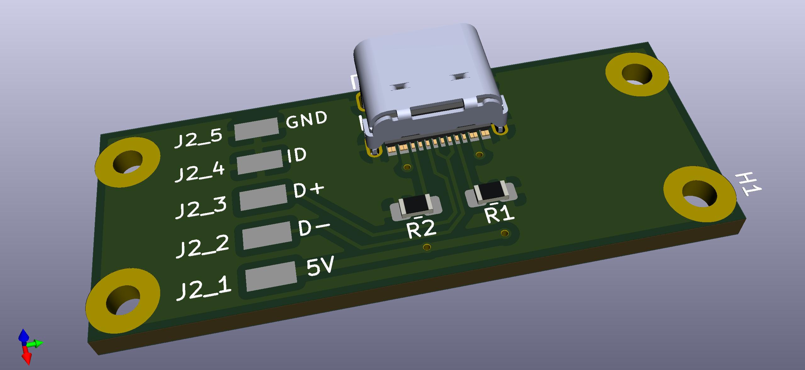
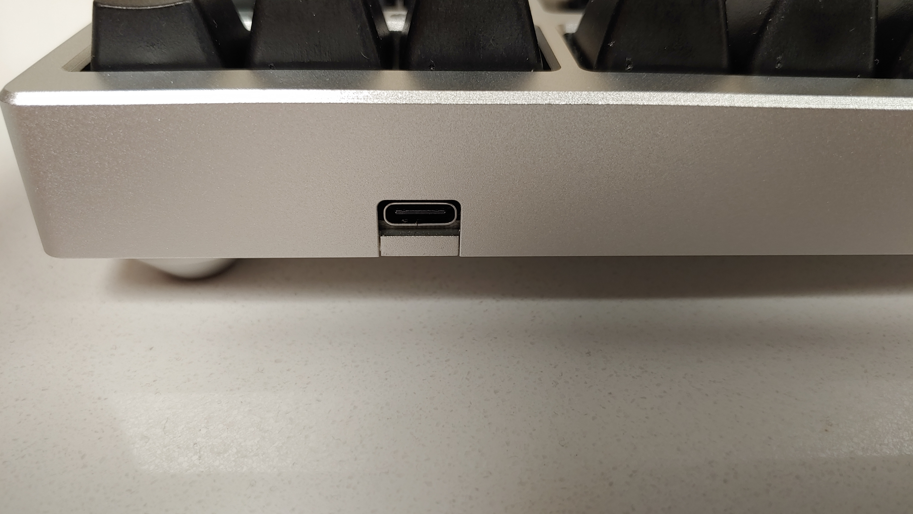

# YMDK/Aliexpress Aluminum CNC TKL Case USB C Daughter Board:
I wanted my new keyboard to use USB C, so I made this.
This daughterboard is intended for use with [this case](https://ymdkey.com/collections/case/products/cnc-anodized-aluminum-case-shell-for-filco-cm-cooler-master-87-tenkeyless-mechanical-keyboard-including-detachable-usb-module)

Credit to sparkfun for the schematic, I used their usb C breakout board as an example.

You can desolder the cable from the daughterboard that comes with the case and use it with this board. 
This works with the screws included with the case, just push hard!

# BOM:
* GCT USB4105 Usb type C port
* 2x 0805 5.1k ohm resistors

I had success with 1.6mm FR4

# Render:

# Installed:

